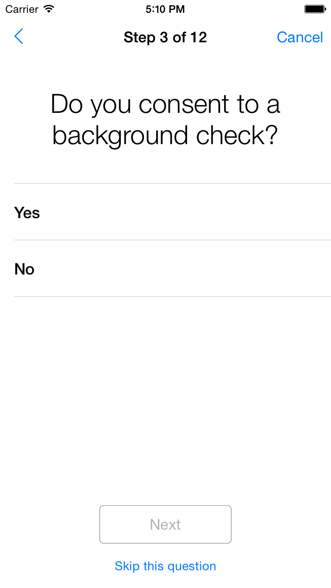
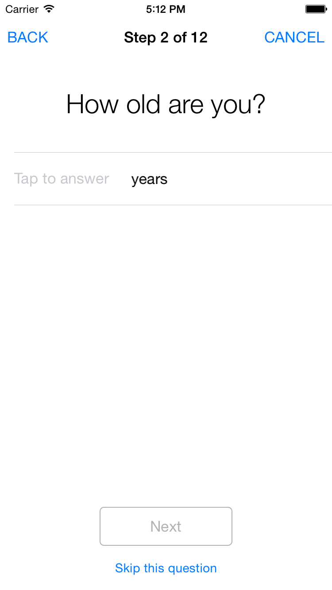

# Cordova ResearchKit Plugin
by [Eddy Verbruggen](http://twitter.com/eddyverbruggen)


## IMPORTANT notes:

* This plugin does not currently work in the simulator because of missing framework slices. Use a real device.
* Installation warning: after `cordova plugin add ..` open the project in XCode 6.3 or higher, choose TARGET > GENERAL > EMBEDDED BINARIES > + > ResearchKit.framework (see [this](https://github.com/researchkit/researchkit#gettingstarted)).


## Supported survey answer formats
At the moment this plugin can only be used for surveys / questionnaires.
[See the demo](demo/index.html) to learn how to use the plugin.
the supported answer formats currently are:

### ORKBooleanAnswerFormat (user must choose yes/no)
```js
  {
    'id': 'question1',
    'title': 'Do you consent to a background check?',
    'answerFormat' : 'ORKBooleanAnswerFormat' // or 'boolean'
  }
```


### ORKNumericAnswerFormat (user must enter a number)
```js
  {
    'id': 'question2',
    'title': 'How old are you?',
    'answerFormat': 'ORKNumericAnswerFormat', // or 'numeric'
    'unit': 'years',
    'minimum': 18, // optional
    'maximum': 80  // optional
  }
```


### More formats will be added soon
